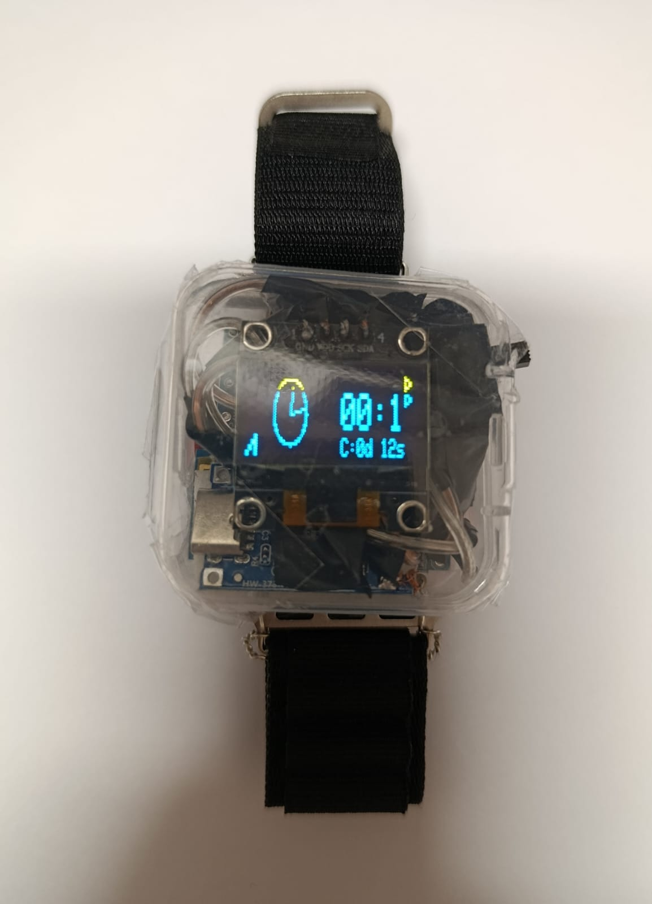
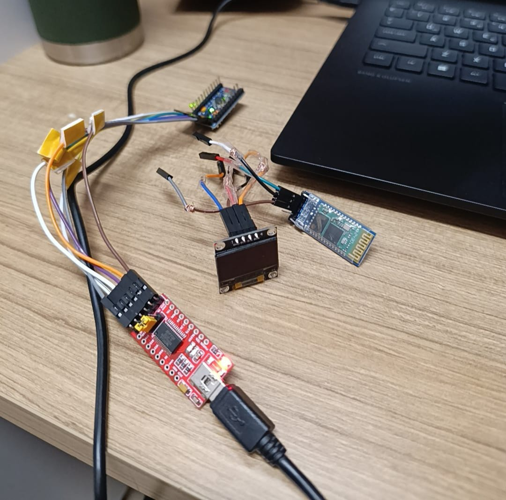
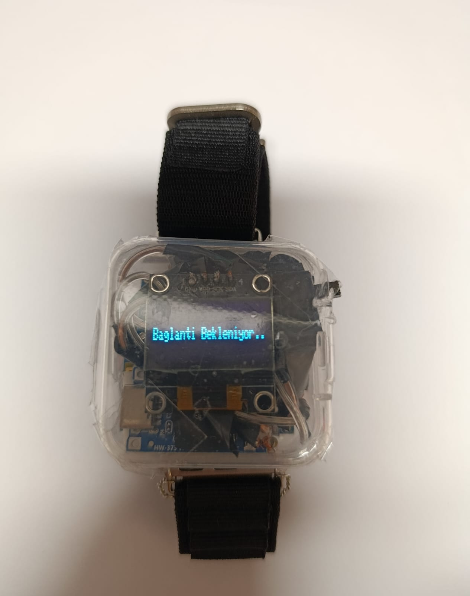
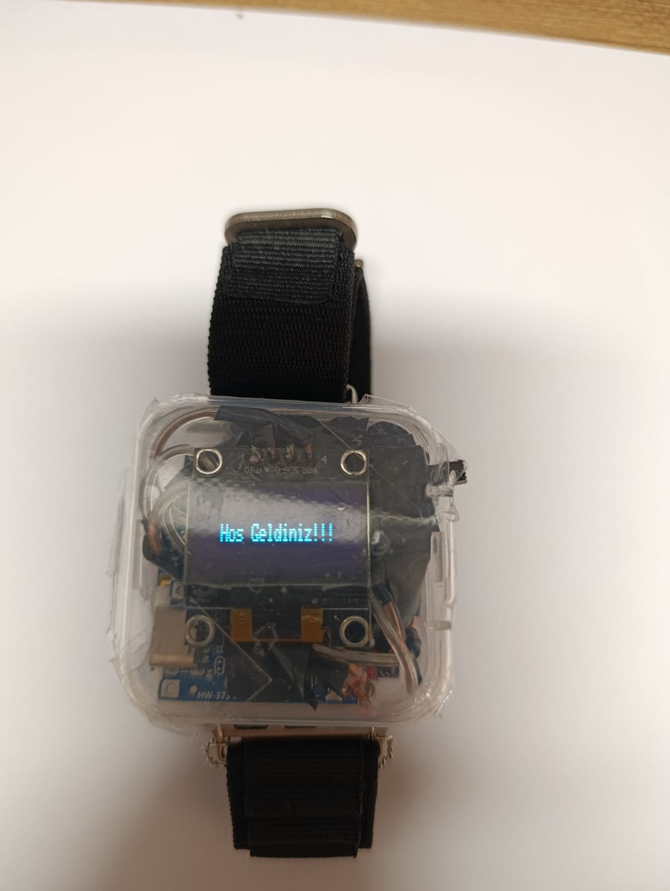
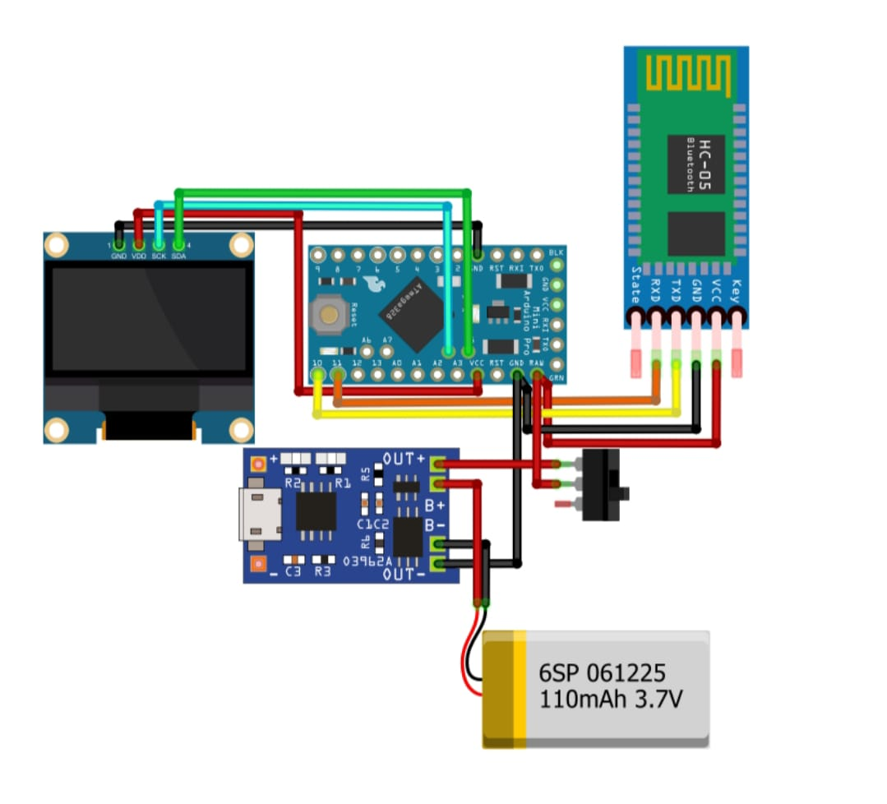

# Maker Smart Watch Project (Arduino Pro Mini & HC-05)

This project is a **compact and portable** smart watch prototype designed from scratch using an **Arduino Pro Mini** and an **HC-05 Bluetooth module**. The primary focus is on rearranging all components to occupy minimum space and establishing two-way communication with a mobile application.

## Key Features

| Feature | Description |
| :--- | :--- |
| **Mobile App Communication** | Ability to connect to a custom mobile application (Android/iOS). |
| **Messaging via App** | Ability to send instant messages or notifications to the watch via the application. |
| **Connection Status Display** | Providing real-time feedback to the user on when the Bluetooth connection is established. |
| **Compact and Wearable Design** | Minimized component sizes through direct soldering to make the design wearable. |

## Hardware and Component List

In this project, jumper pins were removed and components were directly soldered using wires to save space and ensure wearability.

| Component | Model/Detail | Purpose |
| :--- | :--- | :--- |
| **Microcontroller** | **Arduino Pro Mini** (3.3V / 5V) | The main processing unit of the project. |
| **Display** | **OLED Display** | To display the watch interface, notifications, and connection status. |
| **Bluetooth Module** | **HC-05** | To establish serial communication with the mobile application. |
| **Power Source** | **250mAh LiPo Battery** | The power supply for the watch. |
| **Charging Circuit** | **Type-C Battery Charging Module** | To enable easy charging of the LiPo battery. |
| **Programming** | FTDI USB-TTL Converter | (Used only during the code upload phase, not included in the final product). |

[Image of Arduino Pro Mini pinout diagram]

## Assembly and Construction Process Notes

This project was transformed from a prototyping stage into a permanent wearable product. This process involves the most critical and space-saving steps of the project:

1.  **Prototyping:** Initially, all components were connected using **jumper wires** to ensure the code worked flawlessly.
2.  **Space Saving:** Once the working code was uploaded, **unnecessary jumper pins were removed** from all components (especially the HC-05, OLED Display, and Arduino Pro Mini) using a soldering iron.
3.  **Compact Soldering:** All necessary connections were made through **direct soldering** using short, stripped thin wires, achieving maximum space efficiency.
4.  **Case and Wearability:** The soldered circuit was placed into a specially prepared **case**, and a **watch strap** was added to reach its final wearable form.

## Software and Folder Structure

### Coding Environment
* **Development Environment:** Arduino IDE
* **Programming Language:** C++

### Repository Content
| File Path | Description |
| :--- | :--- |
| `https://maker.robotistan.com/wp-content/uploads/2025/06/akilli_saat-apk.zip` | Application for the smart watch connection. |
| `images/` | Photos of the project's construction phases and final version. |

## Project Visuals

| View | Description |
| :---: | :--- |
|  | The final version of the watch with the strap and case. |
|  | Internal view and the process of uploading code to the Arduino. |
|  | Display showing the connection request. |
|  | View of the OLED display interface and connection status. |
|  | General schematic showing how components are interconnected. |

---

**Developer:** Yunus Kunduz  
**YouTube:** [CozumLab](https://www.youtube.com/@CozumLabTR)
